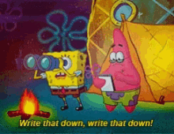

# Guestbook, I Guess It's a Book of Guests
The challenge this time will be to learn how to store data in files and to convert complex structures (arrays/objects) to string representation.

We want to learn this, by creating a good ol' fashioned guest book.
Any visitor on the page can leave a message, that message is then saved and displayed on the page.
Everybody who visits the page can see the messages.

## Must-have features
- [ ] Posts must have the following attributes:
  - [ ] Title
  - [ ] Date
  - [ ] Content
  - [ ] Author name

- [ ] Use at least 2 classes: PostLoader & Post
- [ ] The messages are sorted from new (top) to old (bottom).
- [ ] Make sure the script can handle [site defacement attacks](https://en.wikipedia.org/wiki/Website_defacement): use [htmlspecialchars()](https://www.php.net/htmlspecialchars)
- [ ] Only show the latest 20 posts.

## Nice to have features
- [ ] Profanity filter: at the top of your script create an array of "bad" words. If somebody tries to enter a message with those words, their messages gets rejected.
- [ ] When the user enters uses a "smiley" like ":-)", ";-)", ":-(" replace it with an image of such a smiley.
- [ ] Have an input field where the user can enter how many message he wants to see displayed.

## Features of my own I'd like to add
- [ ] Play an audio file of the viral clip 'watch yo profanity' when the user inputs a "bad" word.
- [ ] Display not only the date, but also the exact time of when the user posted.

## The first step
I'm taking this exercise as an opportunity to structure my PHP code a lot more clear.
In the PHP Blackjack exercise, I had a lot of issues because of the way my code was structured.
Mixing HTML with PHP with some more PHP and then some HTML mixed in with a doze of PHP and then some HTML again and then...
It can get quite confusing and nauseating.

That's when I read the advice our coaches gave us, *separate the view* **(HTML CODE)** as much as possible from the PHP code.
I realized a pretty neat way to do this, all because I was struggling so much in the last exercise.
Back then, my echo and print_r functions sometimes didn't work.
That was because the HTML was all over the place, opening and closing tags disrupted everything.

So, as per the coaches' advice, I made a some PHP files called headerView, bodyView, and footerView.
The headerView contains the head, as well as the opening HTML tag.
The bodyView contains the opening body tag, the closing body tag, and everything in between.
The footerView currently only contains the closing HTML tag.

I'm still unsure if this is the most optimal way to do this.
But, it's a huge step forward from how it looked like before!

## This isn't even my Final Form!
Quite literally, since I'm sure I will be making **a lot** of forms in the future.
For now, I'll try to read on as much as possible on how I can store user input on PHP.
I'm still not sure how to let users their input be shown to other users, so figuring that out is a top priority.

## When in doubt, write it out!

Post Class
-> Has the following:
* Properties:
  * Title, Content, Authorname, and Date
    * These are all strings

So when the user gives us their information for the post, in the $_POST, it will be an array.
I need to turn this array into an object, made out of strings.
That's where the Post Class comes in.
It needs to grab the $_POST array, turn it into an object, so something like this:

`$userInput = new Post($_POST["title"], $_POST["content"], $_POST["authorName"], $_POST["date"],)`

The class creates this object.
Then, the PostLoader stores this object, and is able to retrieve it again.

So my current goal is, is for when I print_r($userInput), the object needs to appear.

